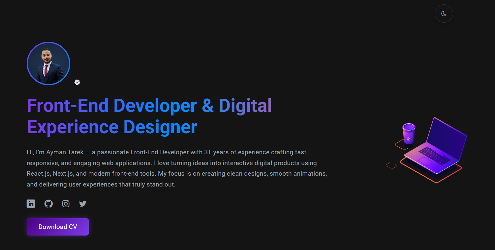

## ✨ React Portfolio

🚀 A fully responsive personal portfolio website built with React.js + Vite, showcasing my projects, skills, and contact details.
This project reflects my journey as a Front-End Developer and is continuously updated with every new project I build.

## 🔑 Main Features

🌙 Dark Mode Toggle – Switch seamlessly between light and dark themes for a better user experience.

👨‍💻 About Me Section – A brief introduction about myself, my background, and social media links.

🗂️ Projects Showcase – Displaying all my projects with live demo and GitHub repo links.

📩 Contact Section – Integrated contact form (Formspree) + direct email for easy communication.

⚡ Responsive Design – Fully optimized for all screen sizes and devices.

📝 Footer – Clean, minimal, and includes copyright info.

### 🛠️ Technologies Used

⚛️ React.js + Vite

🎨 CSS (custom styling)

💾 Local Storage (for theme persistence)

🎯 Icomoon (for custom icons)

📬 Formspree React Library (contact form)

🎥 Framer Motion (animations)

🎬 Lottie React (interactive animations)

### 📌 Site Components

🌙 Dark Mode Toggle

Allows visitors to seamlessly switch between light mode and dark mode according to their preference.

👨‍💻 About Me

A section dedicated to sharing more details about me, including my background, experience, and social media links.

🗂️ Projects

Showcases all my work in an organized way, where each project is represented with a thumbnail/card + description.

Visitors can access both the live demo and the GitHub repository for every project.

📬 Contact Section

Provides multiple ways for visitors to get in touch, including a contact form and my email address.

⚡ Footer

A minimal footer containing copyright information.

