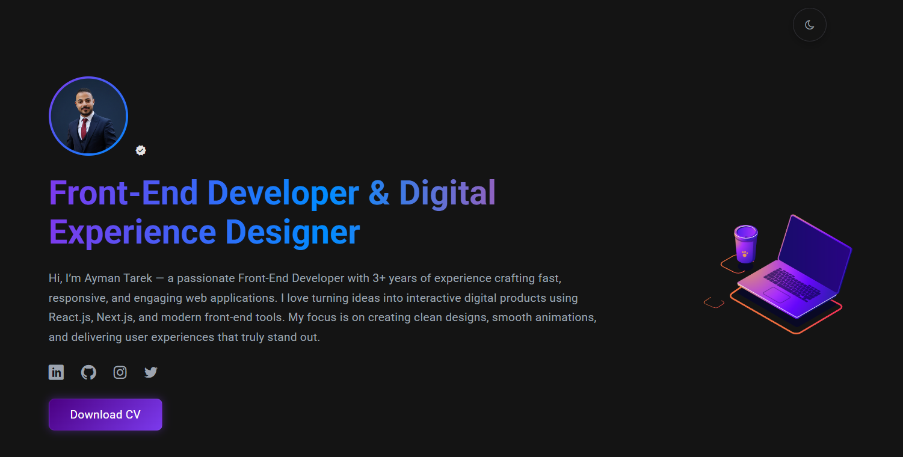

✨ React Portfolio

 

A modern, fully responsive, animated personal portfolio built with React.js + Vite, showcasing my work, skills, and growth as a Front-End Developer.
This project is continuously improved as my experience evolves.

🌠Live Demo

👉 Live Preview

(https://react-portfolio-six-green.vercel.app/)

🔑 Main Features

✔️ Dark / Light Mode

Smooth theme switching with preference saved in Local Storage.

✔️ About Me Section

A professional introduction with background, experience, and social links.

✔️ Projects Showcase

All my projects displayed in a clean grid with:

Thumbnail preview

Short description

Live Demo links

GitHub repository links

✔️ Contact Section

Formspree-powered contact form + direct email option.

✔️ Fully Responsive

Optimized for all devices (mobile, tablet, laptop, 4K).

✔️ Modern Animations

Powered by Framer Motion and Lottie React for smooth interactive UI.

🛠️ Tech Stack

Category	Tools
Frontend	React.js, Vite
Styling	CSS, Icomoon custom icons
State / Storage	Local Storage
Animations	Framer Motion, Lottie React
Forms	Formspree
Build	Vite, npm

🖼️ 

📌 Repository Notes

This is an older project that was re-uploaded after fixing a corrupted local .git folder.
The repository has been re-initialized with a clean Git history and fully restored project structure.

📠Contact

GitHub: https://github.com/aymantarek16

LinkedIn: (https://www.linkedin.com/in/ayman-tarek-617b21229/)
Email: (aymantarekm16@gmail.com)

⭐ If you like this project, consider giving it a star!

